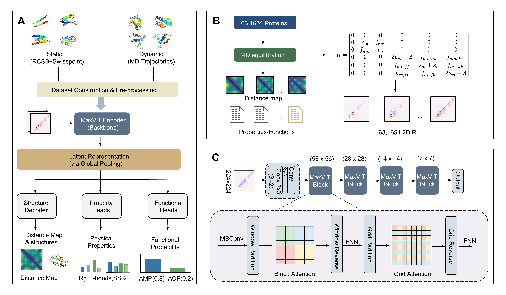

# Deep learning of protein structure and physicochemical properties from two-dimensional infrared spectra
This repository provides a computational framework to infer protein structural representations and physicochemical properties directly from two-dimensional infrared (2D IR) spectra. The framework utilizes a MaxViT-based architecture to process 631,651 computed spectra from static structures and molecular dynamics (MD) trajectories.

The complete dataset link is: this link(https://zenodo.org/records/18365565)



# Getting started
```
git clone https://github.com/LiZhip799/2DIR.git
cd 2DIR
```
# Install all dependencies directly
```
conda create -n 2DIR python=3.8
conda activate 2DIR
conda install pytorch torchvision torchaudio pytorch-cuda=11.8 -c pytorch -c nvidia
pip install -r ./install/requirements.txt
```
# Train physicochemical property prediction
```
python -m torch.distributed.run --nproc_per_node=GPU_COUNT train_props.py
InferenceBash# Generate predictions using best models
python inference.py
```
